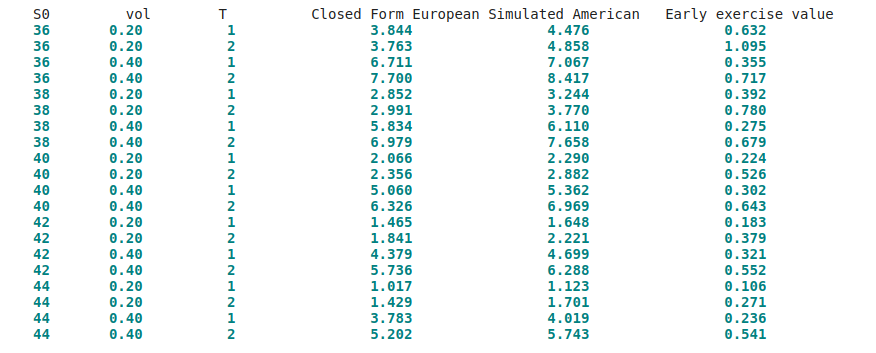

# Practical Sequential Decision Analytics with Python

This is repository to gather and share hands on example of  Sequential Decision Analytics with Python. 

This  collaborative endeavor of [DDA research group](https://bratvoldlab.github.io/website/) at [University of Stavnger](https://www.uis.no/en), is led by Professor [Reidar Brumer Bratvold](https://www.uis.no/nb/profile/reidar-brumer-bratvold).

## Hands-On Examples:

**1) A simple Example of Sequential Decision Making [Link to Codes](https://colab.research.google.com/drive/1ZQhff_7Qo4rSqvIZOYhZzkZBu_x21rQt?usp=sharing)**

This is simple example of developing two projects, A and B and we evaluate four different alternatives. 1) Doing only Project A, 2) Doing A and B simultaneously, 3) Doing A and B Sequentially 4) Do Nothing.

As we can see, the alternative 3 has highest expected value, as it take advantage of learning and flexibility embedded into sequential decision making.

**2) Least Square Monte Carlo for Option Pricing [Link to Codes](https://colab.research.google.com/drive/16u-W2rwk_kYl3uqce5N67x08W3kPiKQF?usp=sharing)**

This code will implement the Least-Squares Monte Carlo for valuing American Option. 

The code will replicate the Table1 of the [Longstaff and Schwartz (2001)](https://people.math.ethz.ch/~hjfurrer/teaching/LongstaffSchwartzAmericanOptionsLeastSquareMonteCarlo.pdf) where the underlying price is GBM model.

