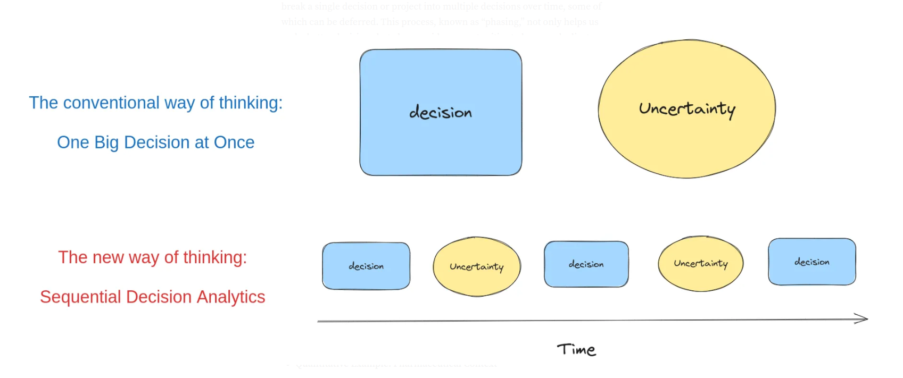
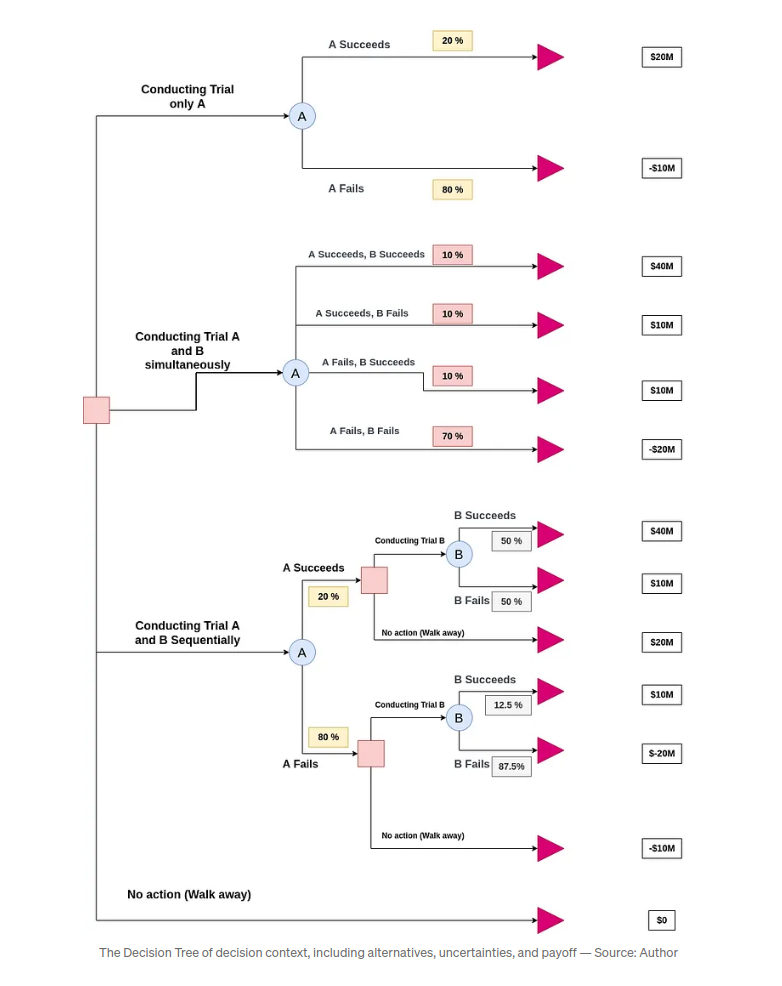

# Practical Sequential Decision Analytics with Python

This is repository to gather and share hands on example of  Sequential Decision Analytics with Python.

## Hands-On Examples:

**A simple Example of Sequential Decision Making**

This is simple example of developing two projects, A and B and we evaluate four different alternatives. 1) Doing only Project A, 2) Doing A and B simultaneously, 3) Doing A and B Sequentially 4) Do Nothing.

As we can see, the alternative 3 has highest expected value, as it take advantage of learning and flexibility embedded into sequential decision making.

